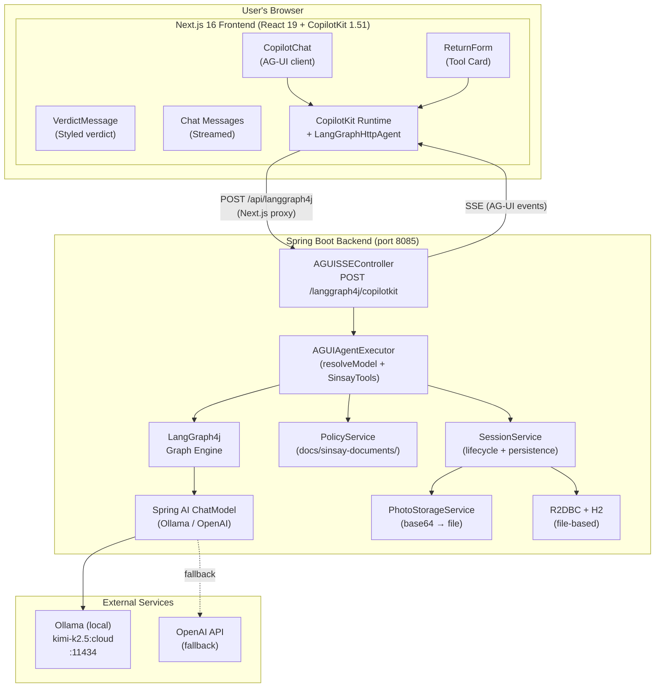
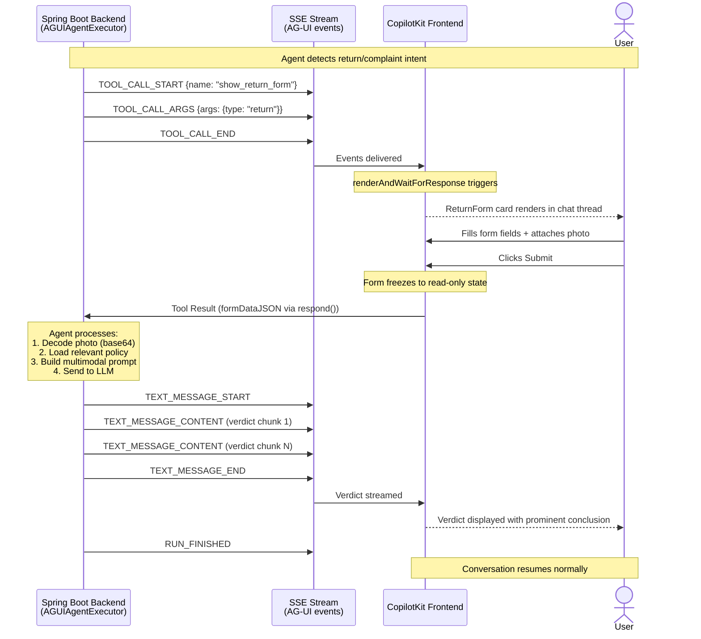
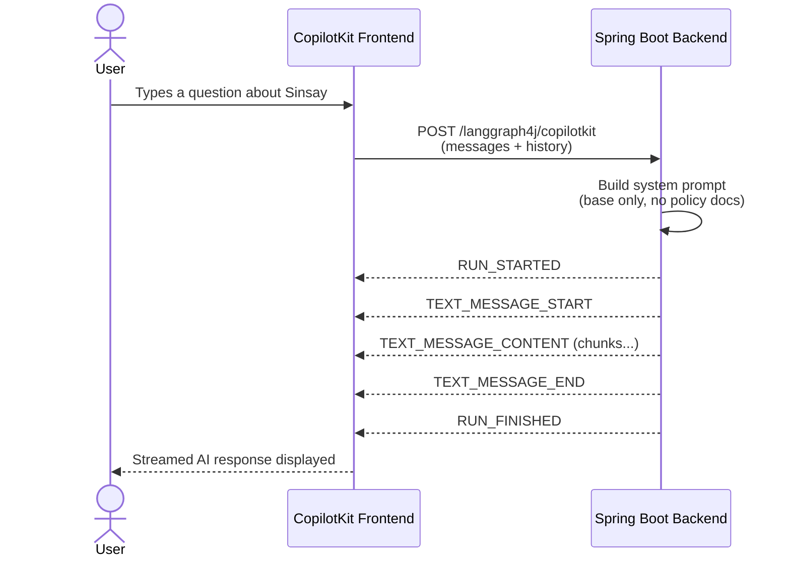
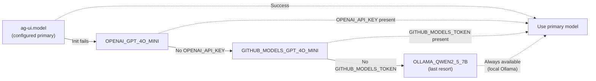
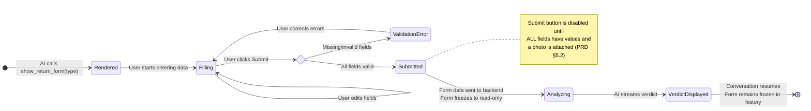
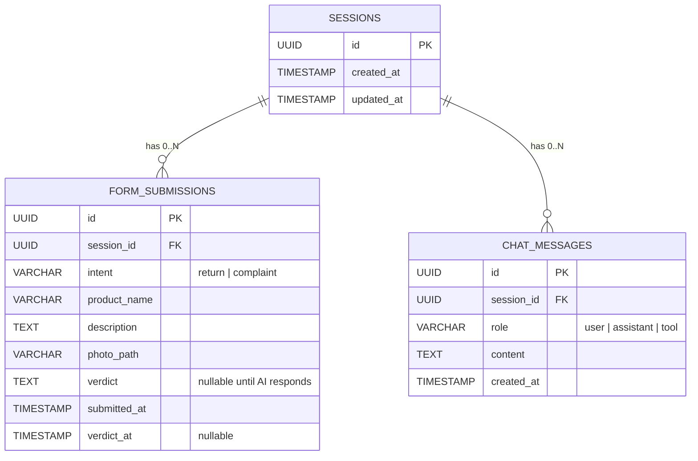
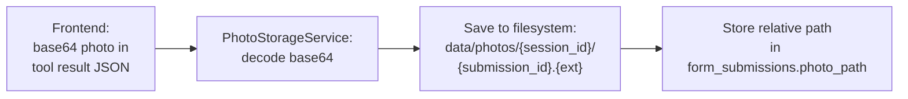

# Architecture Decision Record: Sinsay AI Assistant PoC

**Version:** 1.1
**Status:** Draft
**Date:** 2026-02-26
**Authors:** AI Agent + Development Team

---

## Table of Contents

1. [Executive Summary](#1-executive-summary)
2. [Architecture Overview](#2-architecture-overview)
3. [Backend Architecture](#3-backend-architecture)
4. [Frontend Architecture](#4-frontend-architecture)
5. [AG-UI Protocol & Communication](#5-ag-ui-protocol--communication)
6. [AI Model Strategy](#6-ai-model-strategy)
7. [System Prompt Architecture](#7-system-prompt-architecture)
8. [Tool & Form Flow Architecture](#8-tool--form-flow-architecture)
9. [Persistence Layer](#9-persistence-layer)
10. [Data Structures](#10-data-structures)
11. [Component Inventory](#11-component-inventory)
12. [Implementation Strategy](#12-implementation-strategy)
13. [Security Considerations](#13-security-considerations)
14. [Future Production Path](#14-future-production-path)


---

## 1. Executive Summary

This ADR defines the architecture for a Sinsay AI Assistant Proof of Concept — a chat-based returns/complaints verification tool for the Sinsay fashion brand. The system uses a Spring Boot reactive backend with LangGraph4j agent orchestration, communicating via the AG-UI (Agent-UI) protocol over SSE to a Next.js + CopilotKit frontend.

**Core flow:** User opens chat → AI sends welcome message → free conversation → AI detects return/complaint intent → injects interactive form into chat → user submits form with photo → AI analyzes photo against Sinsay policies → streams verdict → conversation continues.

### Key Architectural Decisions

| Decision               | Choice                                               | Rationale                                                                                            |
| ---------------------- | ---------------------------------------------------- | ---------------------------------------------------------------------------------------------------- |
| Communication protocol | AG-UI over SSE                                       | Already implemented via LangGraph4j + CopilotKit integration                                         |
| AI model               | Configurable default (Kimi K2.5) with fallback chain | Manual control over model selection, resilience via fallbacks                                        |
| Form injection         | AG-UI tool call with `renderAndWaitForResponse`      | CopilotKit native pattern; form awaits backend verdict before returning to chat                      |
| Persistence            | R2DBC + H2 (file-based), normalized schema           | Reactive-compatible, simple for PoC, file persistence survives restarts, extensible to production DB |
| UI framework           | CopilotKit standard components with CSS theming      | Best integration with AG-UI protocol; themed via CSS variables + Sinsay design tokens                |
| Policy injection       | Dynamic selection based on detected intent           | Avoids polluting context window; injects only relevant policy documents                              |

---

## 2. Architecture Overview

### System Context Diagram



### Request Flow

```mermaid
sequenceDiagram
    actor User
    participant Frontend as Next.js Frontend<br/>(CopilotKit)
    participant Proxy as Next.js API Route<br/>POST /api/langgraph4j
    participant Controller as AGUISSEController<br/>POST /langgraph4j/copilotkit
    participant Agent as AGUIAgentExecutor<br/>(LangGraph4j)
    participant LLM as Spring AI ChatModel<br/>(Ollama/OpenAI)

    User->>Frontend: Types message in chat
    Frontend->>Proxy: POST with messages + tools + context
    Proxy->>Controller: Forward to Spring Boot backend
    Controller->>Agent: Deserialize RunAgentInput, delegate to AGUIAgent.run()
    Agent->>LLM: Build prompt (system + history + policies), call model
    LLM-->>Agent: Streamed token response
    Agent-->>Controller: Flux&lt;AGUIEvent&gt; (TEXT_MESSAGE_START/CONTENT/END)
    Controller-->>Proxy: SSE event stream
    Proxy-->>Frontend: SSE forwarded to CopilotKit
    Frontend-->>User: Renders streamed AI message
```

---

## 3. Backend Architecture

### 3.1 Technology Stack

| Component           | Technology                            | Version                |
| ------------------- | ------------------------------------- | ---------------------- |
| Framework           | Spring Boot (WebFlux)                 | 3.5.9                  |
| Language            | Java                                  | 21                     |
| Build               | Maven                                 | wrapper                |
| Reactive            | Reactor (Flux/Mono)                   | Boot-managed           |
| Agent orchestration | LangGraph4j                           | 1.6.2                  |
| AI abstraction      | Spring AI                             | 1.0.0                  |
| AI providers        | Ollama (local), OpenAI, GitHub Models | via Spring AI adapters |
| Persistence         | R2DBC + H2                            | Boot-managed           |
| Serialization       | Jackson                               | Boot-managed           |

### 3.2 Package Structure

```
src/main/java/
├── com/silkycoders1/jsystemssilkycodders1/
│   ├── JSystemsSilkyCodders1Application.java    # Entry point, bean config
│   ├── config/
│   │   └── PersistenceConfig.java               # R2DBC + H2 configuration
│   ├── domain/
│   │   ├── Session.java                         # Session entity
│   │   ├── FormSubmission.java                  # Form data entity
│   │   └── ChatMessage.java                     # Message entity
│   ├── repository/
│   │   ├── SessionRepository.java               # ReactiveCrudRepository
│   │   └── FormSubmissionRepository.java        # ReactiveCrudRepository
│   ├── service/
│   │   ├── SessionService.java                  # Session lifecycle management
│   │   ├── PolicyService.java                   # Policy document loading
│   │   └── PhotoStorageService.java             # Photo file storage
│   └── tools/
│       └── SinsayTools.java                     # show_return_form tool definition
│
└── org/bsc/langgraph4j/agui/                    # AG-UI protocol (existing)
    ├── AGUIAgent.java                           # Agent interface
    ├── AGUIEvent.java                           # Event types
    ├── AGUIType.java                            # Data types
    ├── AGUIMessage.java                         # Message types
    ├── AGUILangGraphAgent.java                  # LangGraph4j → AG-UI bridge
    ├── AGUIAgentExecutor.java                   # Agent with model resolution
    ├── AGUISampleAgent.java                     # Test agent
    └── AGUISSEController.java                   # SSE endpoint
```

### 3.3 Bean Configuration

The application entry point (`JSystemsSilkyCodders1Application`) configures:

- `@ComponentScan` covering both packages
- `AGUIAgent` bean via `@ConditionalOnProperty(name = "ag-ui.agent")`
  - `agentExecutor` → `AGUIAgentExecutor` with configurable model
  - `sample` → `AGUISampleAgent` for testing
- Model selection from `ag-ui.model` property with enum validation

### 3.4 Existing AG-UI Protocol Layer

The `org.bsc.langgraph4j.agui` package is adapted from the LangGraph4j-CopilotKit demo. Key responsibilities:

- **`AGUISSEController`**: REST endpoint (`POST /langgraph4j/copilotkit`), consumes JSON, produces `text/event-stream`
- **`AGUILangGraphAgent`**: Abstract base converting LangGraph4j `NodeOutput`/`StreamingOutput` to AG-UI events. Manages graph-per-thread, interruption state for tool approval
- **`AGUIAgentExecutor`**: Concrete agent building the LangGraph4j graph. Currently uses demo tools (`sendEmail`, `queryWeather`) — to be replaced with Sinsay-specific tools
- **`AGUIEvent`**: Polymorphic event hierarchy (16 event types) with Jackson annotations for SSE serialization

---

## 4. Frontend Architecture

### 4.1 Technology Stack

| Component       | Technology           | Version |
| --------------- | -------------------- | ------- |
| Framework       | Next.js (App Router) | 16.1.6  |
| UI Library      | React                | 19.x    |
| Language        | TypeScript (strict)  | 5.x     |
| Styling         | Tailwind CSS         | 4.x     |
| Chat UI         | CopilotKit           | 1.51.4  |
| Package manager | pnpm                 | latest  |

### 4.2 Directory Structure (Target)

```
frontend/src/
├── app/
│   ├── api/langgraph4j/
│   │   └── route.ts                    # CopilotKit runtime → Spring Boot proxy
│   ├── component/
│   │   ├── SinsayChat.tsx              # Main chat component with CopilotKit
│   │   ├── ReturnForm.tsx              # In-chat return/complaint form card
│   │   └── VerdictMessage.tsx          # Styled verdict display component
│   ├── lib/
│   │   ├── schemas.ts                  # Zod validation schemas
│   │   └── imageResize.ts             # Client-side image resize utility
│   ├── layout.tsx                      # Root layout with CopilotKit provider
│   ├── page.tsx                        # Home page
│   └── globals.css                     # Tailwind + Sinsay CSS variables
├── test/
│   ├── setup.ts                        # Vitest setup (jsdom, testing-library)
│   └── ...                             # Test files mirroring src/ structure
└── ...
```

### 4.3 UI Approach: CopilotKit with Sinsay Theming

**Decision:** Use CopilotKit's standard components (not headless mode) and customize via:

1. **CSS Variables (`CopilotKitCSSProperties`)** — Override CopilotKit's built-in CSS custom properties at the provider level for colors, fonts, spacing
2. **Custom CSS Classes** — Apply Sinsay design tokens via Tailwind utility classes and custom CSS targeting CopilotKit's internal class names
3. **Custom Sub-Components** — Use CopilotKit's component composition API for the form card, verdict display, and other Sinsay-specific UI elements rendered via `renderAndWaitForResponse`

> **Note on PRD "Shadcn UI" reference:** The PRD §7 mentions Shadcn UI components for visual style. Since CopilotKit provides its own component set and we theme it with CSS variables, we do **not** add Shadcn as a dependency. The Sinsay form card (`ReturnForm.tsx`) uses plain Tailwind-styled elements matching the Sinsay design system directly. This avoids a redundant UI library.

**Sinsay Design Tokens (from `docs/sinsay-design-system.md`):**

| Token                   | Value               | Usage                            |
| ----------------------- | ------------------- | -------------------------------- |
| `--color-black`         | `#232323`           | Primary text, submit button fill |
| `--color-white`         | `#ffffff`           | Backgrounds, button text         |
| `--color-grey-300`      | `#c8c8c8`           | Borders, dividers                |
| `--color-grey-500`      | `#959595`           | Secondary text                   |
| `--color-red-500`       | `#d32f2f`           | Error states, rejected verdicts  |
| `--color-green-500`     | `#388e3c`           | Approved verdicts                |
| `--font-family-primary` | `Inter, sans-serif` | All text (matching Sinsay.com)   |

**CopilotKit CSS Variable Overrides:**

```css
:root {
  --copilot-kit-primary-color: #232323;
  --copilot-kit-secondary-color: #f5f5f5;
  --copilot-kit-background-color: #ffffff;
  --copilot-kit-response-button-background-color: #232323;
  --copilot-kit-response-button-color: #ffffff;
}
```

### 4.4 Form Card Component

The `ReturnForm` component renders inside the chat thread via CopilotKit's `renderAndWaitForResponse`. It handles:

- Form fields: Product name (text), Type (select: Zwrot/Reklamacja), Description (textarea, min 20 chars), Photo (file input)
- Client-side validation with Zod schemas
- **Real-time submit button state:** the submit button is disabled until every field has a value and a photo is attached (PRD §5.2)
- Image resize to max 1024px via Canvas API before base64 encoding
- Submit sends data back as tool result to the backend agent
- After submission: form freezes to read-only state
- The UI **awaits the backend verdict** — the tool call remains open until the agent provides a response with the verdict
- **Multiple form instances:** a second `show_return_form` call in the same session renders a new independent form card — previous submitted cards remain frozen in the chat history (PRD §5.2)

### 4.5 Welcome Message

On first load, the AI sends a short welcome message (PRD §5.1). This is implemented via CopilotKit's `initialMessages` prop or the system prompt instructing the agent to greet the user on the first interaction. The welcome message is streamed like any other AI response.

---

## 5. AG-UI Protocol & Communication

### 5.1 Protocol Overview

AG-UI (Agent-UI) is a protocol for bidirectional agent-frontend communication. Events are typed JSON objects streamed via SSE.

### 5.2 Event Types Used

| Event                  | Direction          | Usage in Sinsay PoC                                         |
| ---------------------- | ------------------ | ----------------------------------------------------------- |
| `RUN_STARTED`          | Backend → Frontend | Signals agent run beginning                                 |
| `TEXT_MESSAGE_START`   | Backend → Frontend | New assistant message starting                              |
| `TEXT_MESSAGE_CONTENT` | Backend → Frontend | Streaming text chunk (delta)                                |
| `TEXT_MESSAGE_END`     | Backend → Frontend | Message complete                                            |
| `TOOL_CALL_START`      | Backend → Frontend | Agent requests `show_return_form` — triggers form rendering |
| `TOOL_CALL_ARGS`       | Backend → Frontend | Tool arguments (form type, context)                         |
| `TOOL_CALL_END`        | Backend → Frontend | Tool call metadata complete                                 |
| `RUN_FINISHED`         | Backend → Frontend | Agent run complete                                          |
| `RUN_ERROR`            | Backend → Frontend | Error during agent execution                                |

### 5.3 Tool Call / Form Flow (AG-UI Sequence)



**Key design point:** The form tool uses `renderAndWaitForResponse`, which keeps the tool call open on the frontend. After the user submits the form, the response is sent back to the backend as a tool result. The agent then processes the photo + form data, analyzes against policies, and streams the verdict as regular text messages. The frontend only returns to normal chat mode after the verdict is streamed.

### 5.4 General Conversation Flow (No Form)



---

## 6. AI Model Strategy

### 6.1 Model Configuration

**Primary model:** Configurable via `ag-ui.model` property in `application.properties`.

**Current default:** `OLLAMA_KIMI_K2_5_CLOUD` (Kimi K2.5 via local Ollama at `http://localhost:11434`)

### 6.2 Fallback Chain



Each step catches initialization exceptions and falls through to the next option.

### 6.3 Available Models (AiModel enum)

| Enum Value                  | Provider      | Model             | Requires                      | Multimodal |
| --------------------------- | ------------- | ----------------- | ----------------------------- | ---------- |
| `OLLAMA_KIMI_K2_5_CLOUD`    | Ollama        | `kimi-k2.5:cloud` | Ollama running locally        | Yes        |
| `OLLAMA_QWEN2_5_7B`         | Ollama        | `qwen2.5:7b`      | Ollama running locally        | Limited    |
| `OLLAMA_QWEN3_14B`          | Ollama        | `qwen3:14b`       | Ollama running locally        | Limited    |
| `OPENAI_GPT_4O_MINI`        | OpenAI        | `gpt-4o-mini`     | `OPENAI_API_KEY` env var      | Yes        |
| `GITHUB_MODELS_GPT_4O_MINI` | GitHub Models | `gpt-4o-mini`     | `GITHUB_MODELS_TOKEN` env var | Yes        |

### 6.4 Multimodal Capability

The PRD requires photo analysis (GPT-4o Vision). For the PoC:

- **Kimi K2.5 (Ollama):** Supports multimodal input — can analyze product photos
- **GPT-4o-mini (OpenAI/GitHub Models):** Supports vision — can analyze product photos
- **Qwen 2.5 / Qwen 3 (Ollama fallback):** Limited/no multimodal support — verdict quality may degrade

The agent must encode the submitted photo as base64 and include it in the message to the LLM alongside the form data and policy context.

---

## 7. System Prompt Architecture

### 7.1 Decision: Dynamic Policy Injection Based on Intent

**Problem:** The PRD specifies three policy documents (`zwrot-30-dni.md` ~118 lines, `reklamacje.md` ~55 lines, `regulamin.md` ~231 lines). Including all three in every system prompt wastes context window tokens (PRD §8).

**Decision:** Inject policy documents dynamically based on the conversation state:

| Conversation State                                             | System Prompt Includes                    |
| -------------------------------------------------------------- | ----------------------------------------- |
| General conversation (no intent detected)                      | Base system prompt + general Sinsay info  |
| Return intent detected / form submitted with type=Return       | Base + `zwrot-30-dni.md` + `regulamin.md` |
| Complaint intent detected / form submitted with type=Complaint | Base + `reklamacje.md` + `regulamin.md`   |

### 7.2 System Prompt Structure

```mermaid
block-beta
    columns 1

    block:base["BASE SYSTEM PROMPT (always included)"]
        A["Role: Sinsay customer service assistant"]
        B["Language: respond in user's language (PL/EN)"]
        C["Capabilities: returns, complaints, FAQ"]
        D["Intent detection instructions"]
        E["Tool usage: show_return_form(type)"]
        F["Verdict format requirements"]
        G["Blurry photo handling instructions"]
        H["Welcome message on first interaction"]
    end

    space

    block:policy["POLICY CONTEXT (injected per intent)"]
        I["zwrot-30-dni.md OR reklamacje.md"]
        J["regulamin.md (always when form/intent active)"]
    end

    base --> policy
```



### 7.3 Base System Prompt Content

The base system prompt must instruct the agent to:

1. Act as a Sinsay customer service assistant
2. **Send a short welcome message on first interaction** (PRD §5.1)
3. Respond in the user's language (Polish if Polish, English if English) (PRD §5.3)
4. Ground all answers in provided Sinsay policy documents — never fabricate policies (PRD §5.3)
5. Detect return intent ("chce zwrocic", "zwrot", "oddac", "nie pasuje", "want to return", etc.)
6. Detect complaint intent ("reklamacja", "wadliwy", "uszkodzony", "defekt", "complaint", etc.)
7. When intent is ambiguous, ask one clarifying question before showing the form (PRD §5.3)
8. Call `show_return_form(type)` tool when intent is clear, with type pre-selected
9. After form submission: analyze the photo and description against the relevant policy
10. For returns: check for original tags, signs of use, 30-day window (PRD §5.3)
11. For complaints: identify defect type, assess manufacturing vs user-caused, 2-year window (PRD §5.3)
12. Verdict format: conclusion (prominent) + 2-4 sentence justification + recommended next step (PRD §5.3)
13. **Blurry photo handling:** if the photo cannot be analyzed, ask the user to send a clearer image as a follow-up message (PRD §8)

### 7.4 Implementation

Policy documents are loaded at startup by `PolicyService` from `docs/sinsay-documents/`. The system prompt is assembled dynamically in the agent executor before each LLM call, based on the current form state and detected intent.

---

## 8. Tool & Form Flow Architecture

### 8.1 Tool Definition: `show_return_form`

The backend defines a tool that the LLM can call to inject the form:

```java
@Tool(description = "Show a return or complaint form to the user. " +
      "Call this when the user wants to return a product or file a complaint.")
public String showReturnForm(
    @ToolParam(description = "Type of request: 'return' or 'complaint'") String type
) {
    // Tool execution triggers AG-UI TOOL_CALL events
    // Frontend renders the form via renderAndWaitForResponse
    // Returns the form data submitted by the user (JSON)
}
```

### 8.2 Frontend Tool Registration

```typescript
useCopilotAction({
  name: 'show_return_form',
  description: 'Display return/complaint form in chat',
  parameters: [
    { name: 'type', type: 'string', description: 'return or complaint' },
  ],
  renderAndWaitForResponse: ({ args, status, respond }) => {
    // Render ReturnForm component
    // On submit: respond(JSON.stringify(formData))
    // Form includes: productName, type, description, photo (base64)
  },
});
```

### 8.3 Form Data Schema

```typescript
// Zod schema for validation
const returnFormSchema = z.object({
  productName: z.string().min(1, 'Nazwa produktu jest wymagana'),
  type: z.enum(['return', 'complaint']),
  description: z.string().min(20, 'Opis musi miec co najmniej 20 znakow'),
  photo: z.string().min(1, 'Zdjecie jest wymagane'), // base64
  photoMimeType: z.string(), // "image/jpeg" | "image/png" | "image/webp"
});
```

### 8.4 Image Handling

1. User selects photo via file input
2. Client validates: JPEG, PNG, or WebP only
3. Client resizes to max 1024px (longest edge) using Canvas API
4. Client encodes to base64
5. Base64 string included in tool result JSON
6. Backend passes base64 image to the multimodal LLM along with form data

### 8.5 Form Lifecycle State Machine



### 8.6 Multiple Form Instances

Per PRD §5.2 and §8: if the user wants to submit a second claim in the same session, the agent calls `show_return_form` again. A **new independent form card** renders in the chat thread. Previously submitted form cards remain **frozen (read-only)** in the chat history. Each form instance has its own lifecycle and generates its own verdict.

### 8.7 Approval Flow (Interruption Pattern)

The existing `AGUILangGraphAgent` already supports interruption-based tool approval via LangGraph4j's `InterruptionMetadata`. For `show_return_form`:

1. Agent calls `show_return_form` → LangGraph4j interrupts
2. `AGUILangGraphAgent.onInterruption()` emits `TOOL_CALL_START/ARGS/END` events
3. Frontend renders form via `renderAndWaitForResponse`
4. User submits form → tool result sent back
5. `AGUILangGraphAgent.run()` detects interruption state, passes result back to graph
6. Graph resumes, agent processes form data + photo → streams verdict

---

## 9. Persistence Layer

### 9.1 Decision: R2DBC + H2 with Normalized Schema

> **PRD divergence note:** The PRD §5.4 specifies a flat single-table schema with a `full_transcript` JSON column. This ADR uses a normalized 3-table design instead. Rationale:
>
> - **R2DBC compatibility:** R2DBC requires reactive repositories; a normalized schema with `ReactiveCrudRepository` is idiomatic and portable to production databases (PostgreSQL, MySQL) with zero code changes.
> - **Query flexibility:** Separate tables allow querying form submissions, chat messages, and sessions independently (e.g., "all rejected verdicts", "messages by role").
> - **Transcript reconstruction:** The `chat_messages` table stores all messages with role + timestamp, which can be reconstructed into the PRD's `full_transcript` JSON via a service-layer query (`SELECT * FROM chat_messages WHERE session_id = ? ORDER BY created_at`).
> - **H2 over SQLite:** The PRD mentions SQLite, but R2DBC has no production-quality SQLite driver. H2 with file-based persistence (`h2:file:`) provides equivalent PoC-level durability while staying reactive.

**Rationale:**

- **R2DBC** is reactive-compatible with the WebFlux stack (no blocking JDBC calls)
- **H2** supports file-based persistence (`jdbc:h2:file:./data/sinsay-poc`) — data survives application restarts
- Simple for PoC level but the repository interfaces (`ReactiveCrudRepository`) work unchanged with PostgreSQL, MySQL, etc. for production migration
- No external database server required

### 9.2 Configuration

```properties
# application.properties
spring.r2dbc.url=r2dbc:h2:file:///./data/sinsay-poc
spring.r2dbc.username=sa
spring.r2dbc.password=

# Schema initialization
spring.sql.init.mode=always
spring.sql.init.schema-locations=classpath:schema.sql
```

### 9.3 Schema

```sql
-- schema.sql
CREATE TABLE IF NOT EXISTS sessions (
    id UUID PRIMARY KEY,
    created_at TIMESTAMP NOT NULL DEFAULT CURRENT_TIMESTAMP,
    updated_at TIMESTAMP NOT NULL DEFAULT CURRENT_TIMESTAMP
);

CREATE TABLE IF NOT EXISTS form_submissions (
    id UUID PRIMARY KEY,
    session_id UUID NOT NULL REFERENCES sessions(id),
    intent VARCHAR(20) NOT NULL, -- 'return' or 'complaint'
    product_name VARCHAR(255) NOT NULL,
    description TEXT NOT NULL,
    photo_path VARCHAR(512) NOT NULL,
    verdict TEXT,
    submitted_at TIMESTAMP NOT NULL DEFAULT CURRENT_TIMESTAMP,
    verdict_at TIMESTAMP
);

CREATE TABLE IF NOT EXISTS chat_messages (
    id UUID PRIMARY KEY,
    session_id UUID NOT NULL REFERENCES sessions(id),
    role VARCHAR(20) NOT NULL, -- 'user', 'assistant', 'tool'
    content TEXT NOT NULL,
    created_at TIMESTAMP NOT NULL DEFAULT CURRENT_TIMESTAMP
);
```

### 9.4 Schema Mapping to PRD

| PRD §5.4 Column    | ADR Mapping                                                                 |
| ------------------- | --------------------------------------------------------------------------- |
| `session_id`        | `sessions.id`                                                               |
| `created_at`        | `sessions.created_at`                                                       |
| `intent`            | `form_submissions.intent`                                                   |
| `product_name`      | `form_submissions.product_name`                                             |
| `description`       | `form_submissions.description`                                              |
| `photo_path`        | `form_submissions.photo_path`                                               |
| `verdict`           | `form_submissions.verdict`                                                  |
| `full_transcript`   | Reconstructed from `chat_messages` table via `SessionService.getTranscript()` |

### 9.5 Entity Relationship Diagram



### 9.6 Photo Storage



The `photo_path` column in `form_submissions` stores the relative path. `PhotoStorageService` handles:

- Decoding base64 from the tool result
- Saving to `data/photos/{session_id}/{submission_id}.{ext}`
- Returning the relative path for DB storage

### 9.7 Repository Interfaces

```java
public interface SessionRepository extends ReactiveCrudRepository<Session, UUID> {
}

public interface FormSubmissionRepository extends ReactiveCrudRepository<FormSubmission, UUID> {
    Flux<FormSubmission> findBySessionId(UUID sessionId);
}
```

---

## 10. Data Structures

### 10.1 AG-UI Protocol Types (Existing)

**`RunAgentInput`** — Incoming request from CopilotKit:

```java
record RunAgentInput(
    String threadId,
    String runId,
    Object state,
    List<AGUIMessage> messages,
    List<AGUIType.Tool> tools,
    List<AGUIType.Context> context,
    String forwardedProps
)
```

**`AGUIEvent` hierarchy** — 16 event types (see `AGUIEvent.java`):

- Text messages: `TextMessageStartEvent`, `TextMessageContentEvent`, `TextMessageEndEvent`
- Tool calls: `ToolCallStartEvent`, `ToolCallArgsEvent`, `ToolCallEndEvent`
- Run lifecycle: `RunStartedEvent`, `RunFinishedEvent`, `RunErrorEvent`
- State: `StateSnapshotEvent`, `StateDeltaEvent`, `MessagesSnapshotEvent`
- Other: `StepStartedEvent`, `StepFinishedEvent`, `CustomEvent`

### 10.2 Domain Types (New)

**Session:**

```java
@Table("sessions")
public record Session(
    @Id UUID id,
    LocalDateTime createdAt,
    LocalDateTime updatedAt
) {}
```

**FormSubmission:**

```java
@Table("form_submissions")
public record FormSubmission(
    @Id UUID id,
    UUID sessionId,
    String intent,      // "return" or "complaint"
    String productName,
    String description,
    String photoPath,
    String verdict,
    LocalDateTime submittedAt,
    LocalDateTime verdictAt
) {}
```

**ChatMessage:**

```java
@Table("chat_messages")
public record ChatMessage(
    @Id UUID id,
    UUID sessionId,
    String role,        // "user", "assistant", "tool"
    String content,
    LocalDateTime createdAt
) {}
```

### 10.3 Tool Result (Form Data)

JSON structure sent from frontend as tool result:

```json
{
  "productName": "Koszulka bawelniana biala",
  "type": "return",
  "description": "Koszulka nie pasuje, za mala. Kupiona 5 dni temu, metki sa na miejscu.",
  "photo": "<base64-encoded-image>",
  "photoMimeType": "image/jpeg"
}
```

---

## 11. Component Inventory

### 11.1 Backend Components

| Component                          | Status          | Description                          |
| ---------------------------------- | --------------- | ------------------------------------ |
| `JSystemsSilkyCodders1Application` | Exists          | Entry point + bean config            |
| `AGUISSEController`                | Exists          | SSE endpoint                         |
| `AGUIAgentExecutor`                | Exists (modify) | Replace demo tools with Sinsay tools |
| `AGUILangGraphAgent`               | Exists          | LangGraph4j → AG-UI bridge           |
| `AGUIEvent`                        | Exists          | Event types                          |
| `AGUIType`                         | Exists          | Data types                           |
| `AGUIMessage`                      | Exists          | Message types                        |
| `AGUISampleAgent`                  | Exists          | Test agent                           |
| `SinsayTools`                      | **New**         | `show_return_form` tool definition   |
| `PolicyService`                    | **New**         | Load and cache policy documents      |
| `SessionService`                   | **New**         | Session lifecycle + persistence      |
| `PhotoStorageService`              | **New**         | Photo file storage                   |
| `PersistenceConfig`                | **New**         | R2DBC + H2 config                    |
| `Session`                          | **New**         | Session entity                       |
| `FormSubmission`                   | **New**         | Form submission entity               |
| `ChatMessage`                      | **New**         | Chat message entity                  |
| `SessionRepository`                | **New**         | Reactive session repo                |
| `FormSubmissionRepository`         | **New**         | Reactive form submission repo        |

### 11.2 Frontend Components

| Component            | Status          | Description                                                                      |
| -------------------- | --------------- | -------------------------------------------------------------------------------- |
| `layout.tsx`         | Exists (modify) | Add Sinsay CSS variables to CopilotKit provider                                  |
| `page.tsx`           | Exists (modify) | Render SinsayChat instead of demo component                                      |
| `route.ts`           | Exists          | CopilotKit → Spring Boot proxy                                                   |
| `SinsayChat.tsx`     | **New**         | Main chat with Sinsay system instructions + tool registration + welcome message  |
| `ReturnForm.tsx`     | **New**         | In-chat form card (renderAndWaitForResponse), supports multiple instances         |
| `VerdictMessage.tsx` | **New**         | Styled verdict display (bold conclusion + justification)                         |
| `schemas.ts`         | **New**         | Zod validation schemas                                                           |
| `imageResize.ts`     | **New**         | Canvas API image resize utility                                                  |
| `globals.css`        | Exists (modify) | Add Sinsay design tokens as CSS variables                                        |

### 11.3 Configuration Files

| File                     | Status          | Changes                                          |
| ------------------------ | --------------- | ------------------------------------------------ |
| `application.properties` | Exists (modify) | Add R2DBC, H2, photo storage path                |
| `pom.xml`                | Exists (modify) | Add `spring-boot-starter-data-r2dbc`, `r2dbc-h2` |
| `schema.sql`             | **New**         | H2 schema initialization                         |
| `package.json`           | Exists (modify) | Add test dependencies (Vitest, RTL, MSW)         |

---

## 12. Implementation Strategy

### 12.1 Phase Overview

```mermaid
gantt
    title Implementation Phases (dependency order)
    dateFormat X
    axisFormat %s

    section Phase 1
    PolicyService + SinsayTools + System Prompt (Backend) :p1, 0, 1

    section Phase 2
    ReturnForm + SinsayChat + Theming (Frontend)         :p2, 1, 2

    section Phase 3
    Persistence Layer - R2DBC + H2 (Backend)             :p3, 2, 3

    section Phase 4
    Verdict Flow - Full Stack Integration                :p4, 3, 4

    section Phase 5
    Visual Polish + Sinsay Brand Theming                 :p5, 4, 5
```



### 12.2 Phase Details

#### Phase 1: System Prompt + Policy Service (Backend)

**Goal:** Replace demo tools with Sinsay-specific agent behavior.

1. Create `PolicyService` — loads `zwrot-30-dni.md`, `reklamacje.md`, `regulamin.md` from filesystem at startup
2. Create `SinsayTools` — define `show_return_form(type)` tool with `@Tool` annotation
3. Modify `AGUIAgentExecutor` — replace `Tools` class with `SinsayTools`, build system prompt with base instructions + dynamic policy injection
4. Update `application.properties` with system prompt configuration
5. Write tests: PolicyService loading, system prompt assembly, tool registration

#### Phase 2: Form Component (Frontend)

**Goal:** Interactive form card rendered in chat.

1. Create `ReturnForm.tsx` — form fields, Zod validation, photo handling, disabled submit button until all fields valid (PRD §5.2)
2. Create `imageResize.ts` — Canvas API resize to max 1024px
3. Create `schemas.ts` — Zod schemas for form validation
4. Create `SinsayChat.tsx` — CopilotChat with `useCopilotAction` for `show_return_form`, system instructions, welcome message support
5. Update `page.tsx` and `layout.tsx` — Sinsay theming
6. Update `globals.css` — Sinsay CSS variables
7. Remove demo `chatApproval.tsx` and `chat.tsx`
8. Write tests: form rendering, validation, image resize, tool action registration, multiple form instances

#### Phase 3: Persistence Layer (Backend)

**Goal:** Store sessions, form submissions, and chat messages.

1. Add R2DBC + H2 dependencies to `pom.xml`
2. Create `schema.sql`
3. Create entity records: `Session`, `FormSubmission`, `ChatMessage`
4. Create repositories: `SessionRepository`, `FormSubmissionRepository`
5. Create `SessionService` — session creation, message logging, form submission storage, **transcript reconstruction** (PRD §5.4 `full_transcript`)
6. Create `PhotoStorageService` — base64 decode, file save, path management
7. Create `PersistenceConfig` — R2DBC datasource config
8. Integrate persistence into `AGUIAgentExecutor` / controller layer
9. Write tests: repository operations, service logic, photo storage, transcript reconstruction

#### Phase 4: Verdict Flow (Full Stack Integration)

**Goal:** End-to-end flow from form submission to streamed verdict.

1. Wire form submission data through the agent: decode photo, load policy, build multimodal prompt
2. Agent sends photo + form data + policy context to LLM
3. LLM verdict streamed back via AG-UI text message events
4. Frontend renders verdict with prominent conclusion styling
5. Create `VerdictMessage.tsx` component
6. Persist verdict in `form_submissions` table
7. **Blurry photo handling:** if LLM cannot analyze photo, agent asks user for clearer image (PRD §8)
8. Write integration tests: full flow with mocked LLM responses

#### Phase 5: Visual Polish + Sinsay Theming

**Goal:** Match Sinsay brand design.

1. Apply full Sinsay design system tokens from `docs/sinsay-design-system.md`
2. Style form card: border, shadow, full-width submit button (black fill, white text), wider than text messages
3. Style verdict messages: bold/accented conclusion line (PRD §7)
4. Polish labels: all UI text in Polish (PRD §7)
5. Responsive layout: full-height chat, form wider than text messages (PRD §7)
6. Playwright verification: screenshots, accessibility, interactions

### 12.3 Testing Strategy Per Phase

Each phase follows the TDD process defined in root `CLAUDE.md`:

1. Tests written before production code
2. Tests must fail before implementation
3. All tests pass after implementation
4. `./mvnw test` (backend) and `pnpm test` (frontend) exit clean

---

## 13. Security Considerations

### 13.1 PoC Scope

- **No authentication** — the PoC is open access (PRD non-goal)
- **No HTTPS** — local development only
- **No CORS hardening** — localhost communication

### 13.2 Implemented Safeguards

| Risk               | Mitigation                                                                                    |
| ------------------ | --------------------------------------------------------------------------------------------- |
| API keys in source | Environment variables only (`OPENAI_API_KEY`, `GITHUB_MODELS_TOKEN`); `.env` files gitignored |
| Image upload abuse | Client-side resize to max 1024px; file type validation (JPEG/PNG/WebP only)                   |
| SQL injection      | R2DBC parameterized queries (no raw SQL construction)                                         |
| XSS                | React's built-in escaping; no `dangerouslySetInnerHTML`                                       |
| Prompt injection   | System prompt instructs the agent to ground answers in policy documents only                  |
| DB file in git     | `.db` and `data/` directory gitignored                                                        |

---

## 14. Future Production Path

This section documents decisions made with production migration in mind, even though the PoC does not implement them.

### 14.1 Database Migration

- **PoC:** R2DBC + H2 (file-based)
- **Production:** R2DBC + PostgreSQL — swap the `r2dbc-h2` dependency for `r2dbc-postgresql`, update connection URL. Repository interfaces remain unchanged.

### 14.2 Photo Storage

- **PoC:** Local filesystem (`data/photos/`)
- **Production:** S3-compatible object storage. `PhotoStorageService` interface abstracts the storage backend.

### 14.3 AI Model

- **PoC:** Local Ollama (Kimi K2.5) with cloud fallbacks
- **Production:** Dedicated API endpoint (OpenAI GPT-4o, Azure OpenAI, etc.) with proper rate limiting, key rotation, and cost monitoring.

### 14.4 Authentication & Multi-tenancy

- **PoC:** None (single user, single session per browser tab)
- **Production:** OAuth2/OIDC, session management, tenant isolation.

### 14.5 Deployment

- **PoC:** `./mvnw spring-boot:run` + `pnpm dev`
- **Production (ADR-planned):** Monorepo build bundling Next.js static export into Spring Boot `static/` folder → single deployable JAR. Containerized via Docker.

---

## Appendix A: Sinsay Policy Summary

### Returns (zwrot-30-dni.md)

- **Window:** 30 days from receipt
- **Condition:** Item must be unused and originally tagged (no signs of wear)
- **Methods:** In-store, Paczkomat InPost, DPD courier, self-ship
- **Exclusion:** Bulky items cannot be returned in-store or via parcel machines

### Complaints (reklamacje.md)

- **Window:** 2 years from receipt
- **Scope:** Manufacturing/material defects (seam slippage, fabric tear, stain, pilling)
- **Methods:** In-store (with invoice), courier pickup (free), self-ship
- **Requirement:** Invoice/order number + description of defect

### General Terms (regulamin.md)

- 231 lines covering full store terms and conditions
- Referenced for edge cases not covered by specific return/complaint rules

---

## Appendix B: Existing Code Mapping

| PRD Requirement         | Current Implementation               | Gap                                           |
| ----------------------- | ------------------------------------ | --------------------------------------------- |
| Chat interface          | CopilotChat + AGUISSEController      | Working (demo content)                        |
| SSE streaming           | AGUILangGraphAgent → Flux<AGUIEvent> | Working                                       |
| Tool call + approval    | AGUIAgentExecutor + chatApproval.tsx | Working (demo sendEmail) — needs Sinsay tools |
| AI model selection      | AGUIAgentExecutor.resolveModel()     | Working (configurable + fallback)             |
| Welcome message         | Not implemented                      | **Phase 1** (system prompt) + **Phase 2** (frontend) |
| `show_return_form` tool | Not implemented                      | **Phase 1**                                   |
| ReturnForm component    | Not implemented                      | **Phase 2**                                   |
| Multiple form instances | Not implemented                      | **Phase 2**                                   |
| Sinsay system prompt    | Not implemented                      | **Phase 1**                                   |
| Photo analysis          | Not implemented                      | **Phase 4**                                   |
| Blurry photo handling   | Not implemented                      | **Phase 4**                                   |
| Persistence             | Not implemented                      | **Phase 3**                                   |
| Transcript reconstruction | Not implemented                    | **Phase 3**                                   |
| Sinsay theming          | Not implemented                      | **Phase 5**                                   |
| Verdict display         | Not implemented                      | **Phase 4**                                   |

---
