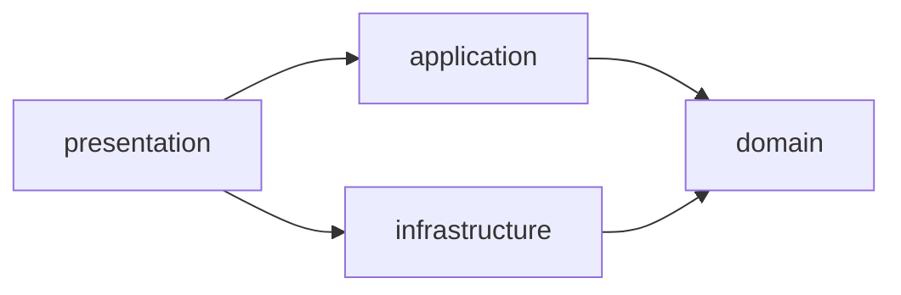
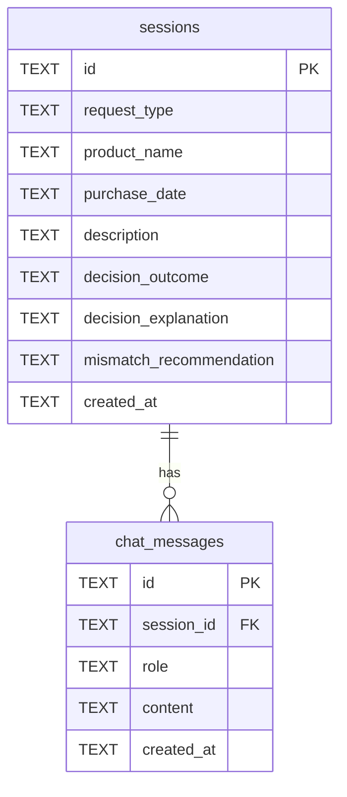
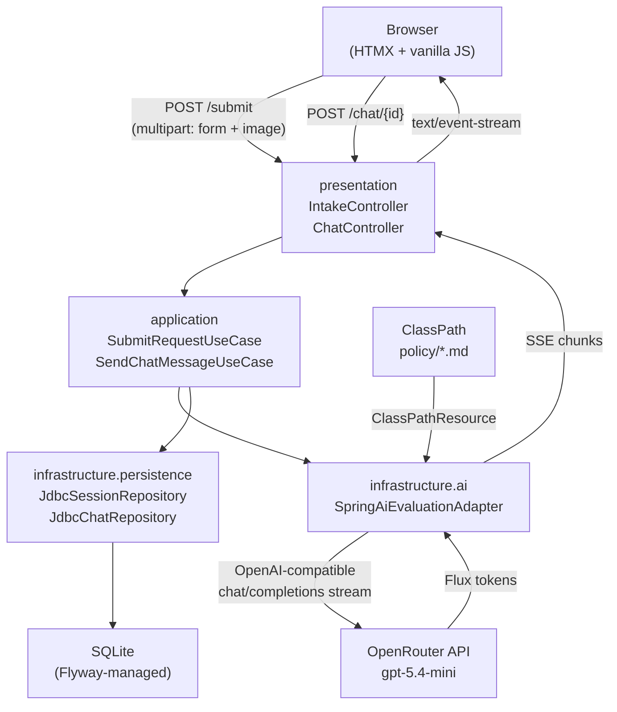
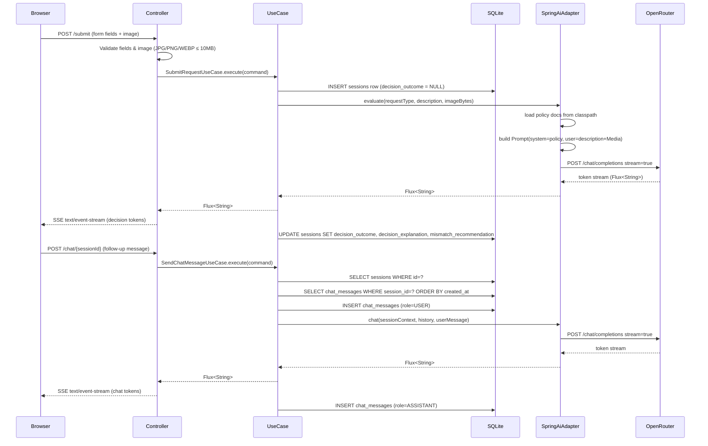
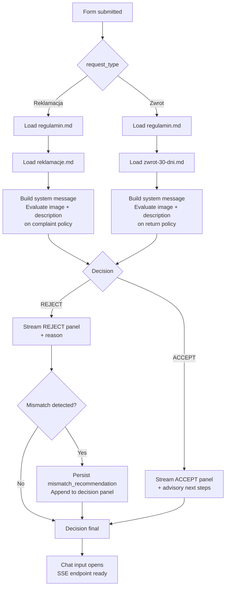

# ADR-001 — AI Complaint & Return Chat: Architecture

**Status**: Accepted
**Date**: 2026-03-26

---

## Context

The system is an advisory-only AI chat for Sinsay customers to submit a complaint (Reklamacja) or return (Zwrot) request, receive a multimodal LLM decision, and ask follow-up questions in Polish. Key constraints from the PRD:

- Polish language only; no backend integration
- Image upload is mandatory for every submission
- Policy document routing is deterministic (per request type)
- Decision must render in under 30 s for 95% of sessions
- MVP scope: single product per session, no authentication

Credentials are stored in [`.env`](../.env) (OpenRouter API key and base URL).

---

## Decision

### Technology Stack

| Layer | Choice | Rationale |
|---|---|---|
| Language | Kotlin (JVM) | Concise, null-safe, first-class Spring support |
| Framework | Spring Boot 3.x — standalone fat JAR | Simple deployment, embedded Tomcat, no external container needed |
| AI integration | Spring AI → OpenRouter (`openai/gpt-5.4-mini`) | OpenAI-compatible client; multimodal Media API; streaming Flux out of the box |
| UI templating | kotlinx.html DSL | Type-safe HTML from Kotlin, no template language context-switch |
| UI interactivity | HTMX 2.x + vanilla JS | Form submission, SSE chat streaming, file preview — no build step required |
| Persistence | SQLite via Spring JDBC | Zero-setup embedded database; sufficient for single-node MVP session history |
| Schema migrations | Flyway | Versioned migrations (`V1__init.sql`); safe schema evolution without manual SQL |
| Build | Gradle 8.x (Kotlin DSL) | Consistent with Kotlin ecosystem; typed build scripts |

---

### Project Structure

Single Gradle module. Clean architecture enforced by package convention — inner layers must not import from outer layers.

```
project-root/
├── build.gradle.kts
├── settings.gradle.kts
├── gradle/wrapper/
├── .env
├── docs/
│   ├── PRD.md
│   ├── ADR.md
│   ├── regulamin.md
│   ├── reklamacje.md
│   └── zwrot-30-dni.md
└── src/
    ├── main/
    │   ├── kotlin/com/lppsa/
    │   │   ├── SinsayApplication.kt
    │   │   │
    │   │   ├── domain/                        # pure Kotlin — no Spring, no JDBC, no AI
    │   │   │   ├── model/
    │   │   │   │   ├── Session.kt             # aggregate root
    │   │   │   │   ├── ChatMessage.kt
    │   │   │   │   ├── Decision.kt            # sealed class: Accept / Reject
    │   │   │   │   └── RequestType.kt         # enum: REKLAMACJA, ZWROT
    │   │   │   └── port/                      # interfaces (driven & driving ports)
    │   │   │       ├── SessionRepository.kt
    │   │   │       ├── ChatRepository.kt
    │   │   │       └── EvaluationPort.kt      # streaming evaluation contract
    │   │   │
    │   │   ├── application/                   # orchestration — depends on domain only
    │   │   │   └── usecase/
    │   │   │       ├── SubmitRequestUseCase.kt
    │   │   │       └── SendChatMessageUseCase.kt
    │   │   │
    │   │   ├── infrastructure/                # adapters — implements domain ports
    │   │   │   ├── ai/
    │   │   │   │   └── SpringAiEvaluationAdapter.kt   # implements EvaluationPort
    │   │   │   ├── persistence/
    │   │   │   │   ├── JdbcSessionRepository.kt       # implements SessionRepository
    │   │   │   │   └── JdbcChatRepository.kt          # implements ChatRepository
    │   │   │   └── config/
    │   │   │       └── AiConfig.kt            # ChatClient bean, policy loader
    │   │   │
    │   │   └── presentation/                  # HTTP layer — depends on application
    │   │       ├── web/
    │   │       │   ├── IntakeController.kt    # POST /submit → SSE stream
    │   │       │   └── ChatController.kt      # POST /chat/{id} → SSE stream
    │   │       └── html/
    │   │           ├── Layout.kt              # kotlinx.html base page shell
    │   │           ├── IntakePage.kt          # intake form rendering
    │   │           └── DecisionPanel.kt       # ACCEPT/REJECT panel + chat UI
    │   │
    │   └── resources/
    │       ├── application.properties
    │       ├── db/migration/
    │       │   └── V1__init.sql               # Flyway baseline migration
    │       ├── static/js/
    │       │   └── upload-preview.js          # file type/size validation + preview
    │       └── policy/                        # policy docs loaded as ClassPathResource
    │           ├── regulamin.md
    │           ├── reklamacje.md
    │           └── zwrot-30-dni.md
    │
    └── test/kotlin/com/lppsa/
        ├── application/
        │   ├── SubmitRequestUseCaseTest.kt
        │   └── SendChatMessageUseCaseTest.kt
        └── infrastructure/
            ├── JdbcSessionRepositoryTest.kt
            └── SpringAiEvaluationAdapterTest.kt
```

**Dependency rule** (enforced by convention, not build isolation):

```
presentation → application → domain ← infrastructure
```

`infrastructure` implements `domain.port` interfaces. `domain` has zero external imports.



---

### Spring AI + OpenRouter Configuration

Spring AI's OpenAI client accepts any OpenAI-compatible endpoint. Configuration via `application.properties`:

```properties
spring.ai.openai.base-url=https://openrouter.ai/api/v1
spring.ai.openai.api-key=${OPENROUTER_API_KEY}
spring.ai.openai.chat.options.model=openai/gpt-5.4-mini
```

`OPENROUTER_API_KEY` is loaded from [`.env`](../.env).

---

### Image Handling

User uploads an image via multipart form. Server reads bytes, wraps in a Spring AI `Media` object, passes it inline with the user message — no storage:

```kotlin
val media = Media(MimeTypeUtils.IMAGE_JPEG, imageBytes.toResource())
val userMessage = UserMessage.builder()
    .text(prompt)
    .media(media)
    .build()
```

Image bytes are discarded after the LLM call completes.

---

### Policy Document Routing

Routing is deterministic at request time — the agent must never load both documents in the same session:

| Request type | System context loaded |
|---|---|
| Reklamacja | `policy/regulamin.md` + `policy/reklamacje.md` |
| Zwrot | `policy/regulamin.md` + `policy/zwrot-30-dni.md` |

Documents are `ClassPathResource` files concatenated into the system message in `AiConfig.kt`.

---

### Streaming

Spring AI `ChatClient.stream().content()` emits `Flux<String>` chunks. The controller exposes a `text/event-stream` endpoint. HTMX SSE extension connects and appends tokens in real time:

```html
<div hx-ext="sse" sse-connect="/api/stream/{sessionId}" sse-swap="token">
  <!-- token chunks appended here -->
</div>
```

---

### Database Schema

Managed by Flyway. Migration file: `src/main/resources/db/migration/V1__init.sql`.

```sql
-- Sessions: one row per form submission
CREATE TABLE sessions (
    id                       TEXT PRIMARY KEY,          -- UUID v4
    request_type             TEXT NOT NULL              -- 'REKLAMACJA' | 'ZWROT'
                             CHECK (request_type IN ('REKLAMACJA', 'ZWROT')),
    product_name             TEXT NOT NULL,
    purchase_date            TEXT NOT NULL,             -- ISO-8601: 'YYYY-MM-DD'
    description              TEXT NOT NULL,
    decision_outcome         TEXT                       -- NULL until evaluated
                             CHECK (decision_outcome IN ('ACCEPT', 'REJECT')),
    decision_explanation     TEXT,                      -- Polish plain-language explanation (≤200 words)
    mismatch_recommendation  TEXT,                      -- populated when request type mismatch detected
    created_at               TEXT NOT NULL DEFAULT (datetime('now'))
);

-- Chat messages: follow-up Q&A after the initial decision
CREATE TABLE chat_messages (
    id          TEXT PRIMARY KEY,                       -- UUID v4
    session_id  TEXT NOT NULL
                REFERENCES sessions(id) ON DELETE CASCADE,
    role        TEXT NOT NULL CHECK (role IN ('USER', 'ASSISTANT')),
    content     TEXT NOT NULL,
    created_at  TEXT NOT NULL DEFAULT (datetime('now'))
);

CREATE INDEX idx_chat_messages_session ON chat_messages (session_id, created_at);
```

**Notes:**
- `sessions.decision_outcome` is `NULL` during streaming; updated atomically when the stream completes.
- System messages (policy docs) are **not stored** — they are rebuilt from classpath on every LLM call.
- The initial evaluation prompt is reconstructed from `sessions.description` + metadata; the decision is injected as the first `ASSISTANT` turn when building follow-up context.
- `mismatch_recommendation` is populated when the agent detects a Reklamacja/Zwrot type mismatch (AC-14).

**Entity relationships:**



---

## Architecture Overview



---

## Request Flow



---

## Document Routing Detail



---

## Rejected Alternatives

| Alternative | Reason rejected |
|---|---|
| Thymeleaf for templating | Extra template files; less type safety than kotlinx.html in Kotlin |
| React / Vue for frontend | Build pipeline overhead; overkill for server-driven UI |
| PostgreSQL | Requires external process; SQLite is sufficient for single-node MVP |
| Batch (non-streaming) responses | 30 s latency requirement; streaming improves perceived speed significantly |
| Direct Anthropic / OpenAI SDK | Spring AI abstracts provider switching; consistent multimodal API |
| Store image in filesystem or DB | Unnecessary for advisory-only system; reduces data retention surface |
| `schema.sql` on classpath | No migration versioning; Flyway enables safe schema evolution as MVP grows |
| Multi-module Gradle | Enforce CA at build level, but overhead is disproportionate for single-team MVP |

---

## Consequences

**Positive**
- Fat JAR deployment is simple (`java -jar app.jar`); no server config needed
- Spring AI abstracts OpenRouter — model or provider can be swapped via config only
- HTMX SSE delivers real-time feel without a JS build step
- SQLite requires no separate database process for MVP
- Flyway migrations allow schema changes to be tracked and applied safely
- Clean architecture by package makes layer responsibilities explicit without multi-module overhead

**Negative / risks**
- SQLite is single-writer; concurrent sessions may queue on writes (acceptable for MVP load)
- `openai/gpt-5.4-mini` must support vision — verify on OpenRouter before launch
- kotlinx.html has limited documentation (45 snippets); team must be comfortable with Kotlin DSL
- CA by package convention relies on team discipline; no build-level enforcement

---

## Revision Trigger

Re-evaluate this ADR if any of the following occur:

- Concurrent session volume exceeds ~50 req/s sustained (SQLite write contention → migrate to PostgreSQL)
- OpenRouter model `openai/gpt-5.4-mini` is deprecated or loses vision capability
- Multi-node / horizontal scaling is required (SQLite is single-node by design)
- Authentication or order-lookup features are added to scope (requires session ownership model)
- Policy documents change frequently (consider loading from a database or CMS instead of classpath)
- Team grows and layer boundary violations become a recurring issue (→ migrate to multi-module Gradle)
