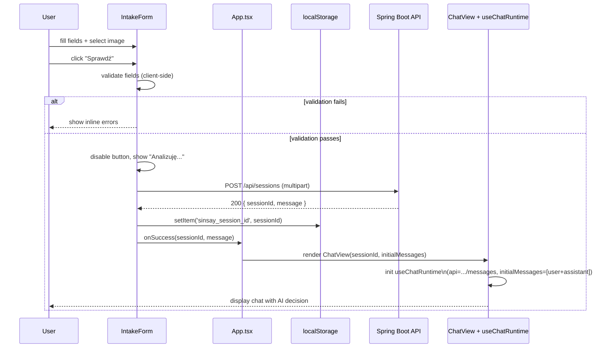
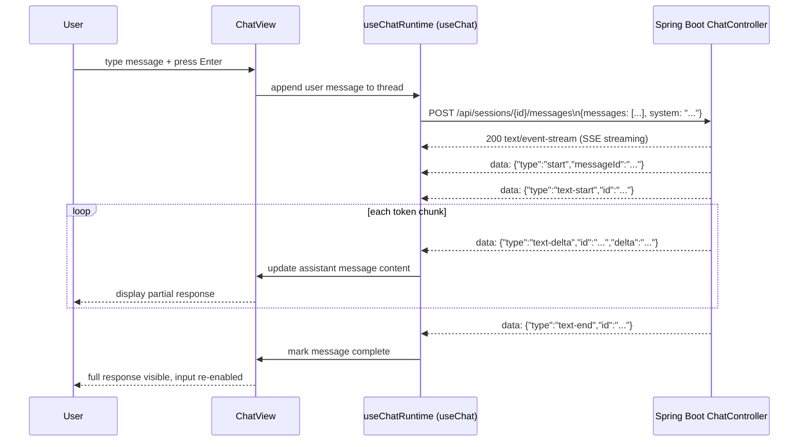

# ADR: Frontend — React 19, assistant-ui, Form → Chat Flow

**Date:** 2026-03-27
**Status:** Accepted
**Relates to:** `docs/ADR/000-main-architecture.md`

---

## 1. Scope

Frontend implementation: React 19 SPA with Vite, assistant-ui runtime selection, form component and validation, chat view, session persistence via localStorage, and session resume.

Does NOT cover: backend endpoints, streaming format implementation, database.

---

## 2. Context7 References

| Library | Context7 Handle | Used for |
|---|---|---|
| assistant-ui | `/assistant-ui/assistant-ui` | Chat components and runtime |
| Vercel AI SDK | `/vercel/ai` | `useChat` hook (via `useChatRuntime`) |
| React | `/reactjs/react.dev` | Core framework |
| Shadcn/ui | `/shadcn-ui/ui` | UI component primitives |
| Tailwind CSS | `/tailwindlabs/tailwindcss.com` | Utility styling |

---

## 3. Component Design

### App.tsx — Root component
- On mount: reads `sessionId` from `localStorage`
- If `sessionId` found: shows `ChatView` (triggers session load from API)
- If no `sessionId`: shows `IntakeForm`
- State: `{ view: 'form' | 'chat', sessionId: string | null }`

### IntakeForm component
Renders the 5-field form. Manages its own field state and validation state.

Fields:
- Intent selector (radio/toggle: "Zwrot" | "Reklamacja")
- Order number (text input)
- Product name (text input)
- Problem description (textarea)
- Image upload (file input with drag-and-drop zone)

Behavior:
- Client-side validation runs on submit (not on each keystroke)
- Image validation: MIME type (`image/jpeg`, `image/png`, `image/webp`, `image/gif`) and size (max 10 MB) checked before submit
- On submit: sends `multipart/form-data` to `POST /api/sessions` via `fetch`
- While loading: submit button disabled, shows "Analizuję..." text with spinner
- On success: stores `sessionId` in localStorage, passes `{ sessionId, initialMessage }` to parent → transitions to `ChatView`
- On error: shows error message near submit button, re-enables form

### ChatView component
- Receives: `sessionId` and optional `initialMessages` (when coming from fresh form submit)
- On mount (if no `initialMessages`): fetches `GET /api/sessions/{sessionId}` to load history → maps to `useChat` message format
- Renders `AssistantUI` components from `@assistant-ui/react`
- "Nowa sesja" button: clears localStorage, calls parent to switch back to `IntakeForm`
- Summary bar at top: shows intent, productName, orderNumber (read-only)

### useSession hook
Custom hook:
- `sessionId`: reads from localStorage on init
- `setSessionId(id)`: writes to localStorage
- `clearSession()`: removes from localStorage

### ChatRuntime setup
Uses `useChatRuntime` with `AssistantChatTransport` from `@assistant-ui/react-ai-sdk`:
```ts
import { useChatRuntime, AssistantChatTransport } from "@assistant-ui/react-ai-sdk";

const runtime = useChatRuntime({
  transport: new AssistantChatTransport({
    api: `/api/sessions/${sessionId}/messages`,
  }),
});
```
The `AssistantChatTransport` sends `{ messages, system, tools }` to the backend endpoint and parses the SSE response (Vercel AI SDK v6 UI Message Stream format with `x-vercel-ai-ui-message-stream: v1` header) automatically. The backend extracts only the last user message from `messages[]` — it maintains its own conversation history in the DB.

For session resume, messages loaded from `GET /api/sessions/{id}` should be pre-populated into the runtime via the `initialMessages` option on the transport or by programmatically appending them after mount.

### Image upload sub-component
- Renders a drag-and-drop zone with click-to-browse fallback
- On file selection: validates MIME type and size immediately (before form submit)
- Shows inline error if invalid
- Shows thumbnail preview + filename on valid selection
- Has a "remove" button to deselect

---

## 4. Data Structures

### Form state (internal to IntakeForm)
```
{
  intent: 'RETURN' | 'COMPLAINT' | null,
  orderNumber: string,
  productName: string,
  description: string,
  image: File | null
}
```

### Validation error state
```
{
  intent?: string,
  orderNumber?: string,
  productName?: string,
  description?: string,
  image?: string,
  submit?: string   // general submit error
}
```

### Message format for AssistantChatTransport / useChatRuntime
The `initialMessages` array must use the Vercel AI SDK `UIMessage` type:
```ts
{
  id: string,
  role: 'user' | 'assistant',
  parts: [{ type: 'text', text: string }],
  createdAt?: Date
}
```
Messages loaded from `GET /api/sessions/{id}` are mapped to this format before passing to the runtime. Note: the `parts` array replaces the old `content` string — each message has structured parts (for this PoC, only `text` parts are used).

### localStorage entry
Key: `sinsay_session_id`
Value: UUID string (the session ID returned by `POST /api/sessions`)

---

## 5. Form → Chat Transition Flow

```
IntakeForm (user fills fields)
    → submit (POST /api/sessions with multipart)
    → [loading state]
    → success: { sessionId, message }
        → localStorage.setItem('sinsay_session_id', sessionId)
        → App.tsx switches to ChatView
        → ChatView receives initialMessages = [
            { id: 'init-0', role: 'user', content: formDescription },
            { id: 'init-1', role: 'assistant', content: message }
          ]
        → useChatRuntime initialized with these initialMessages
        → Chat renders with first AI message visible
        → User types follow-up → useChatRuntime POSTs to /api/sessions/{id}/messages
        → Streaming response displayed token by token
```

On session resume (page reload with sessionId in localStorage):
```
App.tsx mounts
    → reads sessionId from localStorage
    → renders ChatView directly (no form)
    → ChatView mounts: GET /api/sessions/{sessionId}
        → maps messages to useChat format
        → useChatRuntime initialMessages = full history
        → Chat renders with all previous messages
```

---

## 6. Technical Decisions

### assistant-ui runtime: useChatRuntime + AssistantChatTransport
**Status:** Accepted (updated 2026-03-30 — migrated to AI SDK v6 API)
**Context:** assistant-ui offers several runtimes. `useChatRuntime` with `AssistantChatTransport` provides built-in SSE streaming via the Vercel AI SDK v6 UI Message Stream protocol. `useLocalRuntime` allows a fully custom `run` function.
**Decision:** Use `useChatRuntime` from `@assistant-ui/react-ai-sdk` with `AssistantChatTransport`. The transport sends `{ messages, system, tools }` to the backend and parses the SSE response automatically. The Spring Boot backend is designed to emit the UI Message Stream format (`x-vercel-ai-ui-message-stream: v1`), making this a natural fit.
**Rejected alternatives:**
- `useLocalRuntime`: Would require manually reading the `ReadableStream` from `fetch` and parsing the SSE stream — redundant since `AssistantChatTransport` does this automatically.
- `useExternalStoreRuntime`: Designed for fully custom message stores; adds complexity without benefit for this use case.
- `TextStreamChatTransport`: Simpler but loses structured message types and assistant-ui Thread component features.
**Consequences:**
- (+) Streaming, abort, message state management all handled by the library
- (+) `AssistantChatTransport` handles SSE parsing and message assembly
- (-) Tied to Vercel AI SDK v6 UI Message Stream protocol — backend must match exactly
- (-) Transport sends full `messages[]` to backend (backend must extract only the last user message)
**Review trigger:** If assistant-ui deprecates `useChatRuntime` or changes the default protocol.

---

### Image validation: client-side only vs server-side
**Status:** Accepted
**Context:** The PRD requires validation of image format (JPEG/PNG/WebP/GIF) and size (max 10 MB). Both client and server validate.
**Decision:** Validate on the client immediately on file selection (MIME type from `File.type`, size from `File.size`) to give instant feedback. Backend also validates as the authoritative source. This is defense-in-depth — the client validation is UX, the server validation is correctness.
**Consequences:**
- (+) User gets immediate error without submitting
- (-) Slightly duplicated logic (client JS + backend Java)
**Review trigger:** N/A — standard practice.

---

### Form → Chat transition: same page vs route change
**Status:** Accepted
**Context:** The PRD specifies a single-page app with no multi-page navigation.
**Decision:** Both form and chat are rendered by the same `App.tsx` root component. A single piece of state (`view: 'form' | 'chat'`) controls which is shown. No routing library needed. No URL changes.
**Rejected alternatives:**
- React Router: Adds dependency and URL management for a two-screen PoC — unnecessary.
**Consequences:**
- (+) Minimal setup, no routing edge cases (back button, deep links)
- (-) No bookmarkable URLs for specific sessions
**Review trigger:** If the app grows to more than 2 screens.

---

### Vite proxy in development
**Status:** Accepted
**Context:** In development, React runs on port 5173 and Spring Boot on port 8080. Direct API calls would fail due to CORS (or require configuring CORS on the backend for dev only).
**Decision:** Vite dev server proxies `/api/*` to `http://localhost:8080` via `vite.config.ts` proxy configuration. Vite output directory is set to `../backend/src/main/resources/static/`. In production, Spring Boot serves the React build from `backend/src/main/resources/static/` and the `/api/*` paths are on the same origin — no CORS needed.
**Consequences:**
- (+) Clean separation: no CORS config needed in prod; dev matches prod behavior for API paths
- (-) Proxy config must be maintained in `vite.config.ts`
**Review trigger:** If deployment changes to separate FE/BE servers.

---

## 7. Testing Strategy

### Philosophy
Test component behavior from the user's perspective. Use React Testing Library for component tests. Use MSW (Mock Service Worker) to mock HTTP calls. Do not test implementation details (component internals, state variable names). Tests should break if user-visible behavior changes, not if internals are refactored.

### Test layers

| Layer | Type | Tool | Scope |
|---|---|---|---|
| Unit | Form validation logic | Vitest | All field validations, image type/size rules |
| Component | IntakeForm | Vitest + RTL | Field rendering, error messages, loading state |
| Component | ImageUpload | Vitest + RTL | File selection, preview, invalid file errors |
| Component | ChatView | Vitest + RTL + MSW | Session load, message rendering, new message send |
| Integration | Full form → chat flow | Vitest + RTL + MSW | Form submit → chat view transition, localStorage write |
| Integration | Session resume | Vitest + RTL + MSW | localStorage read on mount → history loaded → chat shown |

### Key test scenarios

**IntakeForm — validation:**
- Submit with no intent selected → shows error next to intent field
- Submit with empty orderNumber → shows error next to orderNumber
- Submit with empty description → shows error
- Submit with no image → shows image error
- Select a .pdf file → inline image error shown immediately (before submit)
- Select a 10.1 MB JPEG → inline size error shown immediately
- Select a valid 1 MB JPEG → no error, thumbnail shown
- All fields valid → submit button enabled, no errors shown

**IntakeForm — submission:**
- On submit: button text changes to "Analizuję...", button disabled
- On API success: `localStorage.setItem('sinsay_session_id', ...)` called with UUID
- On API success: parent callback called, transitions to chat view
- On API error: error shown near submit button, button re-enabled

**ChatView — session resume:**
- localStorage contains valid sessionId on mount → `GET /api/sessions/{id}` is called
- History messages rendered in correct order (sequenceNumber)
- 404 from API → localStorage cleared, form view shown
- "Nowa sesja" button click → localStorage cleared, form view shown

**ChatView — sending a message:**
- User types message and submits → new message appears in chat immediately
- Loading indicator shows while streaming
- Streamed response appears token by token (MSW simulates streaming)
- After stream completes, input is re-enabled

**Image upload component:**
- Drag-and-drop triggers file selection
- Valid file shows filename and thumbnail preview
- "Remove" button clears the selection

### Technical acceptance criteria (Frontend)

- TAC-FE-01: `IntakeForm` with all fields empty — submitting shows 5 validation error messages (one per field)
- TAC-FE-02: File input with `application/pdf` MIME type → error message "Dozwolone formaty: JPEG, PNG, WebP, GIF" visible without form submission
- TAC-FE-03: File input with size > 10,485,760 bytes → error message mentioning "10 MB" visible without form submission
- TAC-FE-04: Successful form submit → `localStorage.getItem('sinsay_session_id')` returns a non-empty string
- TAC-FE-05: Page load with `sinsay_session_id` in localStorage → no form rendered, chat rendered with loaded messages
- TAC-FE-06: "Nowa sesja" button click → `localStorage.getItem('sinsay_session_id')` returns null and form is rendered
- TAC-FE-07: Chat input submit → `POST /api/sessions/{id}/messages` called with correct `content` field in body
- TAC-FE-08: All user-visible text in Polish (form labels, placeholders, button text, error messages)
- TAC-FE-09: Form and chat are usable on viewport width 375px (no horizontal scroll, no overflow)

---

## 8. Sequence Diagram — Form Submission and Chat Init



---

## 9. Sequence Diagram — Chat Message Streaming


