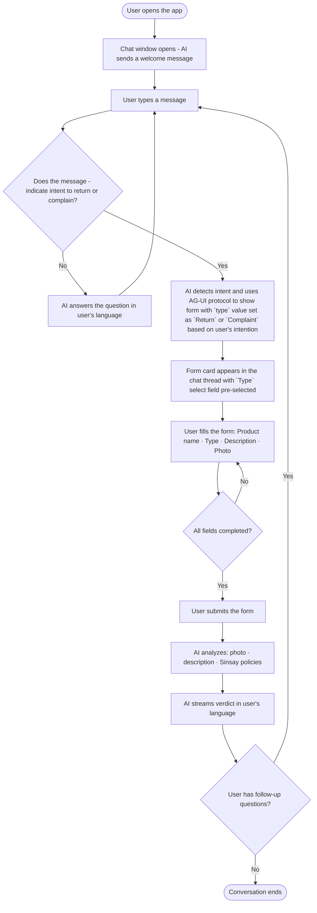
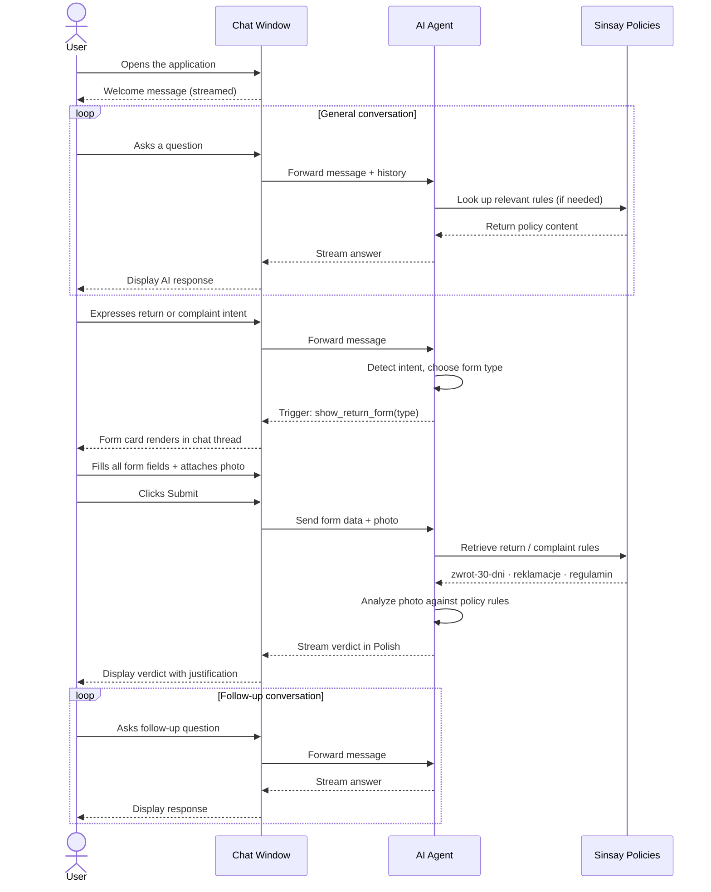
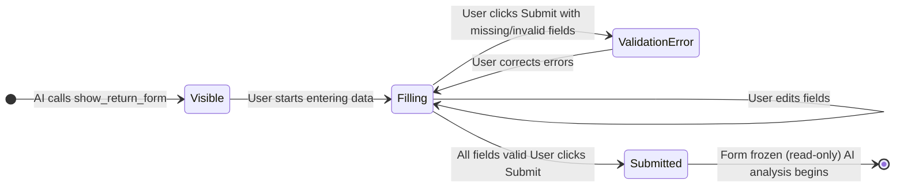

# Product Requirements Document: Sinsay AI Assistant PoC

**Version:** 2.0
**Status:** Active
**Date:** 2026-02-25
**Target Audience:** AI coding assistants and developers

---

## 1. Introduction & Overview

This PoC validates the technical feasibility of using multimodal AI (GPT-4o Vision) to assist Sinsay customers with product returns (_Zwrot_) and complaints (_Reklamacja_) through a conversational interface.

The application opens directly as a **chat**. The user can have a free conversation — asking about the Sinsay offer, return windows, complaint procedures, or any general customer service question. The AI responds as a knowledgeable Sinsay assistant in Polish.

When the conversation reveals that the user wants to initiate a return or file a complaint, the AI agent **injects a structured form component directly into the chat window** as an interactive message. The user fills the form in context, submits it with a product photo, and the AI analyzes the data against Sinsay's policies to issue a justified verdict — all within the same chat.

---

## 2. Goals

1. **Natural entry point** — users start a conversation without any barrier; no form to fill before asking a question.
2. **Contextual form injection** — the data collection form appears only when needed, triggered by the AI detecting return/complaint intent.
3. **Validate in-chat interactive components** — test the pattern of rendering interactive React forms as chat messages.
4. **Validate AI verdict quality** — confirm GPT-4o can analyze a product photo and description against Sinsay's return/complaint regulations to produce a justified Polish verdict.
5. **Data persistence** — log all sessions, form submissions, photos, and verdicts locally for post-analysis.

## 3. User Stories

1. **As a Customer**, I want to ask the AI about Sinsay's return policy so I know my options before committing to a return.
2. **As a Customer**, I want to ask general questions about the Sinsay offer, store locations, or current promotions.
3. **As a Customer**, I want the AI to respond in Polish if I ask a question in Polish, and in English if I ask a question in English so the experience feels natural.
4. **As a Customer**, I want to select whether I am making a "Return" or a "Complaint" so the system applies the correct rules (30 days vs. 2 years).
5. **As a Customer**, I want to upload a photo of my product and receipt so the verification happens instantly without waiting for an email.
6. **As a Customer**, I want to see a clear explanation of why my return was rejected (e.g., "The item appears worn").
7. **As a Developer**, I want all chat sessions and verdicts saved to a local SQLite database so I can manually review the AI's performance later.

---

## 4. User Journey

### 4.1 High-Level Flow



### 4.2 Detailed Interaction Sequence



### 4.3 In-Chat Form Lifecycle



---

## 5. Functional Requirements

### 5.1 Chat Interface

- The application opens directly as a full-height chat window — no landing form, no onboarding screen.
- The AI sends a short welcome message on first load.
- The user can type freely and receive streamed responses.
- Chat history persists for the duration of the browser session.
- The thread must render three types of messages:
  - Plain text user messages
  - Plain text AI messages (streamed)
  - **In-chat form cards** (interactive React components, see §4.2)

### 5.2 In-Chat Form Component

When the AI detects return/complaint intent, it calls the `show_return_form` tool. The frontend renders this as an interactive card in the chat thread.

**Form fields — all mandatory:**

| Field        | Type            | Details                                                                                             |
| ------------ | --------------- | --------------------------------------------------------------------------------------------------- |
| Product name | Text input      | Name of the product                                                                                 |
| Type         | Select dropdown | Options: `Return` (Zwrot) · `Complaint` (Reklamacja). Pre-populated by the AI, editable by the user |
| Description  | Textarea        | Problem description or return reason. Minimum 20 characters                                         |
| Photo        | File input      | Photo of the product or defect. JPEG / PNG / WebP. One file                                         |

**Behaviour:**

- All fields validate on submit attempt; errors display inline.
- The submit button is disabled until every field has a value and a photo is attached.
- The photo is resized client-side to max 1024px (longest edge) before encoding.
- After successful submission the form card becomes **read-only** (frozen state showing submitted values). The user cannot re-submit.
- A second `show_return_form` call in the same session renders a new independent form card — previous submitted cards remain frozen in the history.

### 5.3 AI Agent Behaviour

**General conversation mode:**

- Responds in Polish or English (depending on the user's language).
- Answers questions about: return windows, complaint procedures, product categories, store locations, payment options, loyalty points.
- Grounds all answers in the content of `docs/sinsay-documents/` (`zwrot-30-dni.md`, `reklamacje.md`, `regulamin.md`).
- Does not fabricate Sinsay policies.

**Intent detection:**

- Calls `show_return_form(type: "return")` when the user signals: _"chcę zwrócić"_, _"zwrot"_, _"oddać"_, _"nie pasuje"_, _"want to return"_, etc.
- Calls `show_return_form(type: "complaint")` when the user signals: _"reklamacja"_, _"wadliwy"_, _"uszkodzony"_, _"defekt"_, _"complaint"_, etc.
- When intent is ambiguous, asks one clarifying question before triggering the form.

**Verdict after form submission:**

For **returns** (`type: return`):

- Assess photo: are original tags present? Signs of use (wear, stains, washing)?
- Apply rule: item must be unused and originally tagged. Return window is 30 days from receipt.
- Verdict: _"Zwrot możliwy"_ or _"Zwrot niemożliwy"_ + Polish justification + next steps.

For **complaints** (`type: complaint`):

- Identify defect type from photo: seam slippage, fabric tear, stain, pilling, etc.
- Assess: manufacturing/material defect vs. user-caused damage.
- Apply rule: complaint window is 2 years from receipt.
- Verdict: _"Reklamacja uzasadniona"_ or _"Reklamacja nieuzasadniona"_ + Polish justification + next steps.

The verdict message must contain: the conclusion (prominent), 2–4 sentence justification referencing the applicable policy rule, and the recommended next step for the user.

### 5.4 Persistence

Every session is stored in SQLite:

| Column            | Type      | Content                                                |
| ----------------- | --------- | ------------------------------------------------------ |
| `session_id`      | UUID      | Unique session identifier                              |
| `created_at`      | Timestamp | Session start time                                     |
| `intent`          | String    | `return` · `complaint` · `null` (if no form submitted) |
| `product_name`    | String    | From submitted form                                    |
| `description`     | String    | From submitted form                                    |
| `photo_path`      | String    | Local path to saved photo file                         |
| `verdict`         | String    | AI verdict text                                        |
| `full_transcript` | JSON      | Complete message array for the session                 |

---

## 6. Non-Goals (Out of Scope)

- **Authentication** — no login required; the PoC is open access.
- **Production deployment** — running via `./mvnw spring-boot:run` + `npm run dev` is sufficient.
- **Order number validation** — the agent does not verify order numbers against a real Sinsay database.
- **Multiple photos per submission** — the form accepts one photo.
- **Email notifications** — verdicts are displayed in-chat only.
- **Returning to previous sessions** — each page load starts a fresh session.

---

## 7. Design Considerations

### Chat window

- Full-height, full-width layout.
- User messages: right-aligned with Sinsay brand colour.
- AI messages: left-aligned on a light background.
- Form cards: left-aligned, visually distinct with a border and subtle shadow, wider than regular messages to accommodate all fields.

### Wireframes

- `docs/assets/sinsay-wireframe-1-step.png` (chat window with first agent's message)
- `docs/assets/sinsay-wireframe-2-step.png` (chat window with form card in chat thread)

### In-chat form card layout

```
┌─────────────────────────────────────────────┐
│  Formularz Zwrotu / Reklamacji              │
│  [context summary from AI]                  │
│                                             │
│  Nazwa produktu *                           │
│  [________________________]                 │
│                                             │
│  Typ zgłoszenia *                           │
│  [ Zwrot ▼ ]  or  [ Reklamacja ▼ ]          │
│                                             │
│  Opis problemu *                            │
│  [________________________]                 │
│  [________________________]                 │
│                                             │
│  Zdjęcie produktu *                         │
│  [ + Dodaj zdjęcie ]  filename.jpg ✓        │
│                                             │
│       [ Wyślij do asystenta ]               │
└─────────────────────────────────────────────┘
```

### Visual style

- Sinsay brand: monochrome, clean, minimal. Shadcn UI components.
- Follow strictly Sinsay Design System: `docs/sinsay-design-system.md`
- Submit button: full-width, black fill, white text.
- Verdict message: the conclusion line (e.g. "Reklamacja uzasadniona ✓") is visually prominent — bold or accented.

### Language

- All UI labels in **Polish**.
- AI responses in Polish or English (depending on the user's language).

---

## 8. Technical Constraints

- **Image resize:** Canvas API on the client, max 1024px longest edge, before base64 encoding.
- **Multiple form instances:** If the user wants to submit a second claim in the same session, a second form card must render independently while the first remains frozen.
- **Blurry photo handling:** If GPT-4o cannot analyse the photo, the agent asks the user to send a clearer image. For MVP: user sends a follow-up message with a new photo — no full form re-render.
- **System prompt length:** Injecting `zwrot-30-dni.md` OR `reklamacje.md` (depending on the form type) + `regulamin.md` (always) into the system prompt alongside conversation history and image — do not polute the context window with unnecessary information.

---

## 9. Success Metrics

| Metric                    | Target                                                         |
| ------------------------- | -------------------------------------------------------------- |
| Intent detection accuracy | Correct `type` pre-selected in ≥90% of unambiguous messages    |
| Verdict accuracy          | Correct classification of photo evidence in ≥85% of test cases |
| Form usability            | User completes and submits in ≤2 attempts                      |
| Streaming latency         | First token within 3 seconds of form submission                |
| Persistence               | 100% of sessions with submitted forms recoverable from SQLite  |
