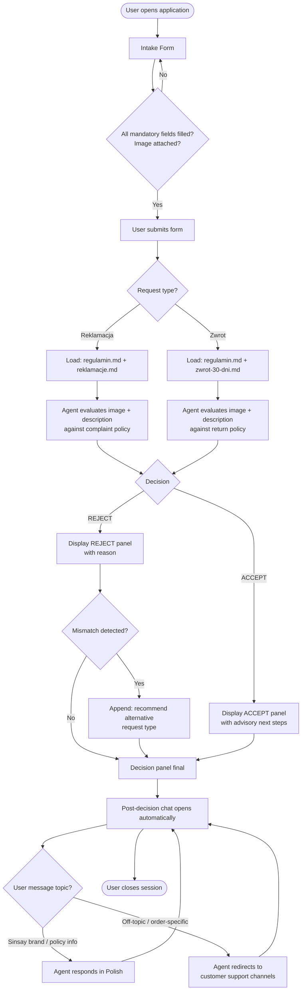
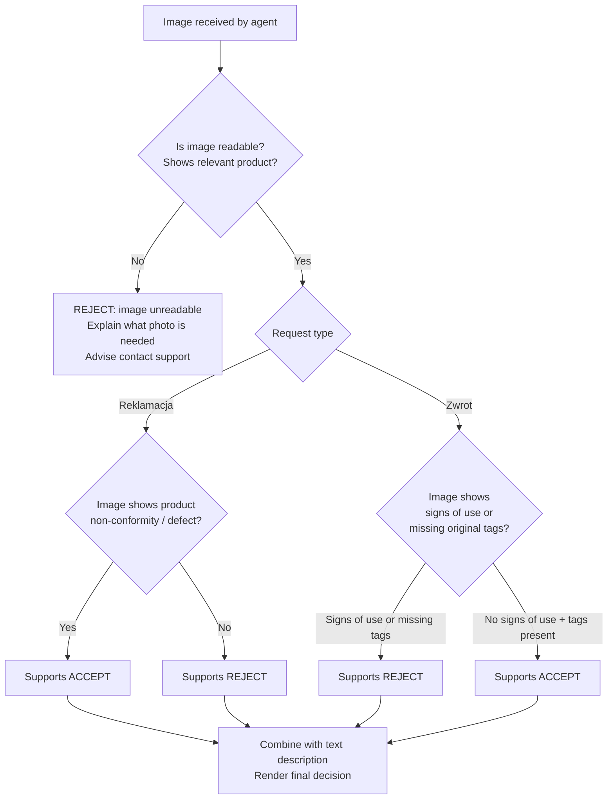
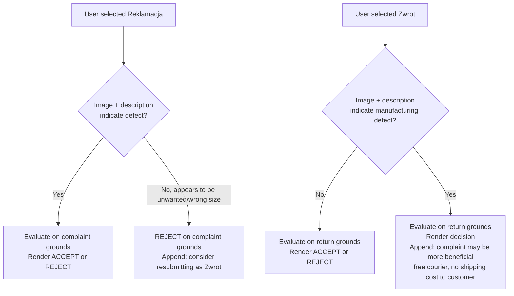

# PRD — AI Complaint & Return Processing Chat (Sinsay)

Chat for AI-assisted complaint and return advisory for e-commerce plant products.

## Policy Documents

| Document | Used when |
| --- | --- |
| [regulamin.md](regulamin.md) | Every session — always loaded |
| [reklamacje.md](reklamacje.md) | Request type = Reklamacja only |
| [zwrot-30-dni.md](zwrot-30-dni.md) | Request type = Zwrot only |

---

## 1. Executive Summary

An AI-powered web interface that allows Sinsay customers to submit a complaint or return request via a structured intake form, receive an advisory accept/reject decision from a multimodal LLM agent, and ask follow-up questions about the brand and policies in a post-decision chat. The system is advisory only — it does not initiate any backend process or submit requests to LPP systems. Polish language only.

---

## 2. Problem Statement

Customers with defective products or return requests currently must navigate LPP's customer panel, find the correct form, understand the applicable policy, and manually determine whether their case qualifies. This creates friction, support volume, and misrouted requests (e.g. complaints filed as returns and vice versa). The agent reduces this friction by evaluating the customer's case against policy documents and giving a clear, explained decision before the customer takes any action.

---

## 3. Users / Personas

**Persona 1 — Marta, 28, regular online shopper**
Bought a blouse. Received it with a visible stitching defect. She knows something is wrong but is unsure whether this is a "complaint" or a "return." She wants a fast answer without calling the hotline.

**Persona 2 — Tomasz, 35, occasional buyer**
Bought shoes. They fit poorly. He wants to return them. He is not sure if the 30-day window has passed or if the condition of the item still qualifies. He wants confirmation before packing anything.

**Persona 3 — Agnieszka, 42, first-time Sinsay customer**
Bought a home item. She sees visible damage she believes was present at delivery. She has never filed a complaint online before and does not know what documentation is required or what outcome to expect.

---

## 4. Main Flow

### 4.1 Happy Path — Complaint (Reklamacja)

1. User lands on the application page.
2. User selects request type: **Reklamacja** (Complaint).
3. User fills in mandatory form fields: product name, purchase date, problem description.
4. User uploads a product image (mandatory). Submit button remains disabled until an image is attached.
5. User submits the form.
6. Agent receives: form data + uploaded image + system context documents: `regulamin.md` + `reklamacje.md`.
7. Agent evaluates the image and description against the complaint policy (product non-conformity, visible defect, within 2-year window from purchase date — date is accepted as stated, not verified).
8. Agent renders a decision panel:
   - **ACCEPT** or **REJECT** label.
   - Plain-language explanation in Polish (max 200 words).
   - If ACCEPT: advisory next steps (e.g. fill in the complaint form in the customer panel, free courier pickup available).
   - If REJECT: reason + if the case appears to be a return rather than a complaint, a recommendation to resubmit as Zwrot.
9. Below the decision, a chat input opens automatically.
10. User may ask follow-up questions. Agent responds with Sinsay brand/policy information.
11. Session ends when user closes or navigates away.

### 4.2 Happy Path — Return (Zwrot)

Steps 1–4 are identical to 4.1, except the user selects **Zwrot** (Return). From step 5:

1. User submits the form.
2. Agent receives: form data + uploaded image + `regulamin.md` + `zwrot-30-dni.md`.
3. Agent evaluates the image and description against the return policy (no signs of use, original tags present, within 30-day window from purchase date — date accepted as stated, not verified).
4. Agent renders a decision panel:
   - **ACCEPT** or **REJECT** label.
   - Plain-language explanation in Polish (max 200 words).
   - If ACCEPT: advisory next steps (e.g. return options: physical store, InPost locker, DPD courier, own shipping).
   - If REJECT: reason + if the case appears to show a product defect rather than a simple return, a recommendation to resubmit as Reklamacja.

Steps 9–11 are identical to 4.1 (chat opens, user asks follow-up questions, session ends on close).

### 4.3 Edge Case — Unreadable or Irrelevant Image

Steps 1–5 are identical to 4.1 or 4.2. The divergence occurs after submission:

1. Agent receives the submission.
2. Agent cannot evaluate the product condition from the image (blurry, too dark, wrong subject, or otherwise unusable).
3. Agent renders a **REJECT** decision noting that the image could not be evaluated, explaining what a usable image should show (e.g. the product laid flat in good lighting, defect area clearly visible), and advising the user to contact Sinsay support directly with clearer documentation.
4. Chat opens. User may ask follow-up questions.

### 4.4 Edge Case — Request Type Mismatch

- User selects **Reklamacja** but description and image show no defect — product is simply unwanted or wrong size.
  - Agent renders REJECT within complaint logic. Rejection message includes: "Na podstawie opisu i zdjęcia nie stwierdzono niezgodności towaru z umową. Jeśli chcesz zwrócić produkt, złóż wniosek jako Zwrot."
- User selects **Zwrot** but image and description clearly show a manufacturing defect.
  - Agent renders decision within return logic (may accept or reject on return grounds). Decision message includes: "Zauważyliśmy, że produkt może posiadać wadę. Rozważonego złożenia reklamacji zamiast zwrotu — reklamacja jest bezpłatna i obejmuje odbiór kurierski na koszt sklepu."

---

## 5. User Stories

**US-01** — As a customer with a defective product, I want to submit a complaint with a photo so I receive an advisory decision without calling the hotline.

**US-02** — As a customer who changed their mind about a purchase, I want to submit a return request so I know whether my item qualifies before I pack it.

**US-03** — As a customer filling in the intake form, I want to be prevented from submitting without attaching an image, so I understand upfront that a photo is required.

**US-04** — As a customer who selected the wrong request type, I want the rejection message to tell me which process to use instead, so I don't lose time filing again blindly.

**US-05** — As a customer whose uploaded image was too blurry to evaluate, I want to be told clearly that the image was the problem and what a valid image looks like, so I can take action.

**US-06** — As a customer who received an ACCEPT decision, I want plain-language next-step instructions, so I know exactly how to proceed with the complaint or return.

**US-07** — As a customer who received a REJECT decision, I want a plain-language explanation of why, so I understand the policy reasoning and do not feel arbitrarily dismissed.

**US-08** — As a customer in the post-decision chat, I want to ask basic questions about Sinsay contact details, store locations, or policy rules, so I don't have to leave the page to search.

**US-09** — As a customer whose return-eligible product also shows a manufacturing defect, I want the agent to flag the better process in the decision message, so I don't inadvertently pay for return shipping when a free complaint is available.

**US-10** — As a customer, I want the decision to be rendered in under 30 seconds, so the experience feels responsive and not abandoned.

---

## 6. Acceptance Criteria

### Intake Form

- AC-01: Submit button is disabled until all mandatory fields are filled: request type, product name, purchase date, problem description, image upload.
- AC-02: Submit button is disabled if no image is attached, regardless of all other fields being filled.
- AC-03: Accepted image formats: JPG, PNG, WEBP. Max file size: 10 MB. If format or size is invalid, an inline error is shown and form does not submit.
- AC-04: Purchase date field accepts any valid calendar date without business-rule validation (no rejection for dates outside policy windows).
- AC-05: Only one request type can be selected (Reklamacja or Zwrot) — radio input, no multi-select.

### Document Routing

- AC-06: Every agent session loads `regulamin.md` as a system context document.
- AC-07: When request type is Reklamacja, agent session loads `reklamacje.md` and does NOT load `zwrot-30-dni.md`.
- AC-08: When request type is Zwrot, agent session loads `zwrot-30-dni.md` and does NOT load `reklamacje.md`.

### Agent Decision

- AC-09: Agent renders a decision within 30 seconds of form submission for 95% of sessions.
- AC-10: Decision panel contains exactly one outcome label: ACCEPT (Wniosek wstępnie pozytywny) or REJECT (Wniosek wstępnie negatywny).
- AC-11: Decision explanation is written in Polish, is plain-language (no legal citation by paragraph number), and does not exceed 200 words.
- AC-12: ACCEPT decisions include advisory next steps referencing the correct process (complaint: customer panel form + free courier; return: available return methods).
- AC-13: REJECT decisions include the specific reason why the policy criteria were not met.
- AC-14: When a mismatch between selected request type and evaluated case is detected, the decision message includes a recommendation to resubmit using the alternative request type.
- AC-15: When the submitted image is unreadable or irrelevant, the agent renders REJECT and specifies that the image quality prevented evaluation, with guidance on what a usable image should show.
- AC-16: Agent does not initiate any backend action (no complaint/return submission, no label generation, no account lookup).

### Post-Decision Chat

- AC-17: Chat input is displayed immediately after the decision panel renders — no user action required to reveal it.
- AC-18: Agent responds in Polish to questions about: Sinsay brand information, contact details, store locations, general complaint and return procedures, shipping and payment policies.
- AC-19: Agent responds to off-topic questions (order status, account management, product availability, third-party delivery issues) with a redirect message pointing to customer support channels (support.pl@sinsay.com, tel. 58 353 65 65).
- AC-20: Agent does not reverse a rendered decision within the chat session. If the user disputes the outcome, the agent explains the decision and redirects to customer support.
- AC-21: Agent does not process a new complaint or return request within the chat. If the user wants to resubmit, they must reload the page.

---

## 7. Out of Scope

The following are explicitly excluded from MVP:

- User authentication, login, or account linking
- Order number input or purchase verification against LPP systems
- Policy window validation (30-day return / 2-year complaint) — date is collected but not checked
- Actual submission of complaints or returns to LPP backend
- Return label generation
- Free courier scheduling for complaints
- Refund calculation or payment processing
- Order status tracking
- Multi-product sessions (one product per session only)
- Human agent escalation or live chat handoff
- Languages other than Polish
- Mobile native app
- Email or SMS notifications
- Saving session history

---

## 8. Technical and Business Constraints

- **Language**: Polish only. All UI labels, agent responses, and error messages must be in Polish.
- **Single product per session**: The intake form collects data for one product. Users who need to file for multiple products must complete separate sessions.
- **No purchase validation**: Purchase date is collected as a mandatory field for context only. The agent uses it as reference in evaluation but the system does not validate it against policy deadlines.
- **Advisory only**: The system produces no binding legal or commercial decision. All output is labeled advisory. The agent's output is an automated preliminary assessment and does not represent an official LPP decision.
- **Document routing is deterministic**: The agent must not load both `reklamacje.md` and `zwrot-30-dni.md` in the same session. Routing is determined by the user's request type selection, not by agent inference.
- **Image is mandatory**: The form must enforce this at the UI level, not rely on the agent to request it post-submission.
- **Post-decision chat scope is bounded**: The agent must not offer opinions on specific active orders, commitments on refund timelines, or legally binding interpretations of the terms.
- **Branding**: The application operates under the Sinsay / LPP S.A. brand. The agent must refer to the company as "Sinsay" in all customer-facing responses.

---

## 9. MVP Success Metrics

| Metric | Target |
| --- | --- |
| Form completion rate (submissions / page loads) | ≥ 65% |
| Sessions reaching a decision (no abandonment after submit) | ≥ 95% |
| Decision rendered within 30 seconds | ≥ 95% of sessions |
| Sessions where mismatch recommendation is displayed | Tracked (baseline only in MVP) |
| Post-decision chat engagement (at least 1 message sent after decision) | ≥ 30% of sessions |
| Agent responses flagged as off-topic or incorrect by user (if feedback widget added) | ≤ 10% |

---

## 10. User Flow Diagrams

### 10.1 Overall Application Flow

### 10.2 Image Evaluation Logic

### 10.3 Request Type Mismatch Handling

